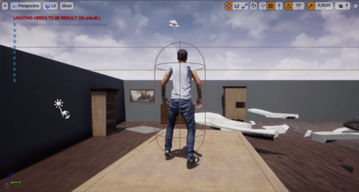

# About Food Game
This repository contains a project which I created with Antoni Janas (RzukLudojad) at AGH University of Science and Technology. 
The main idea of the project was to create a video game that was grounded in the kitchen setting. The game consists of three maps on which the player has to collect the appropriate vegetables or fruits to move forward.

We prepared the game using Unreal Engine and assets found in Epic Store.

